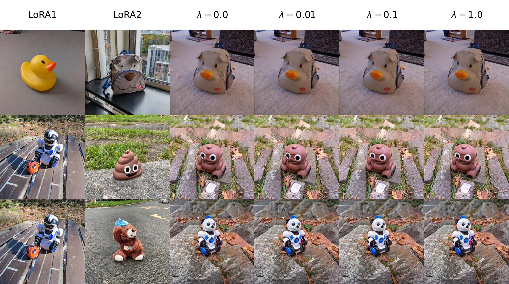

# ZipLoRA-ablation

This repository is based on the unofficial implementation of ZipLoRA, [ziplora-pytorch](https://github.com/mkshing/ziplora-pytorch) by [mkshing](https://x.com/mkshing0). It adds the missing ablation study on the soft orthogonality regularization term that was not included in the original ZipLoRA paper ([https://ziplora.github.io](https://ziplora.github.io)).

Our experimental results show that when image generation is performed using exactly the same initial noise, the presence or absence of the soft orthogonality regularizer does **not** affect the generated image semantics.

This raises an important question: **Does mathematical orthogonality necessarily imply semantic disentanglement?** For a deeper discussion, please refer to our related work:
**[Rethinking Inter-LoRA Orthogonality in Adapter Merging: Insights from Orthogonal Monte Carlo Dropout](https://arxiv.org/abs/2510.03262).**



## Installation

Please note the versions of the following libraries:

```
pip install diffusers==0.24.0 huggingface_hub==0.21.4 transformers==4.36.0
```

## Usage

Please download [DreamBooth](https://github.com/google/dreambooth) and place it in a directory at the same level as this repository.

```
bash train_single_lora.sh
bash train_zip_lora.sh
bash generate.sh
```

## Citation

If you find this repository helpful for your research, please consider citing our paper:

```
@article{zhang2025rethinking,
  title={Rethinking Inter-LoRA Orthogonality in Adapter Merging: Insights from Orthogonal Monte Carlo Dropout},
  author={Zhang, Andi and Ding, Xuan and Wang, Haofan and McDonagh, Steven and Kaski, Samuel},
  journal={arXiv preprint arXiv:2510.03262},
  year={2025}
}
```
